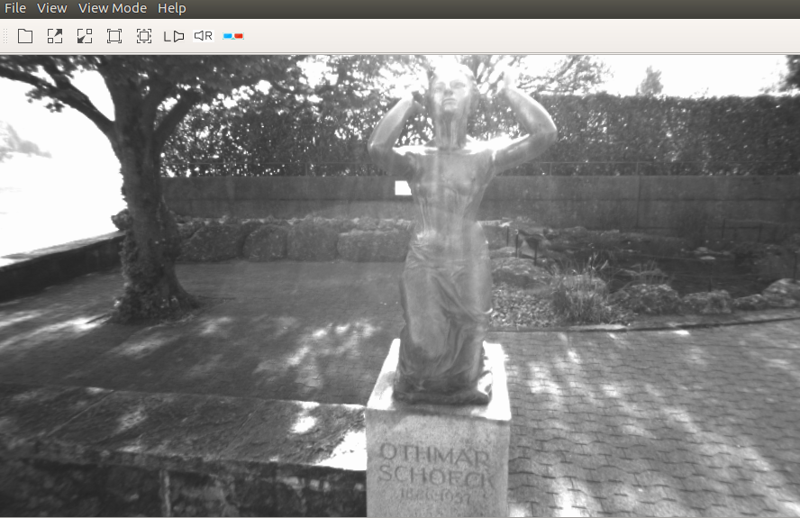
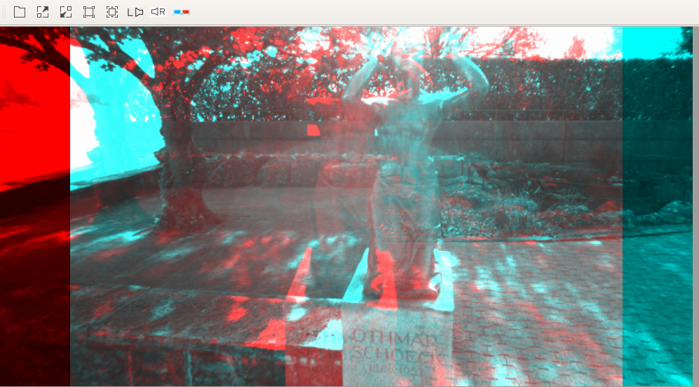
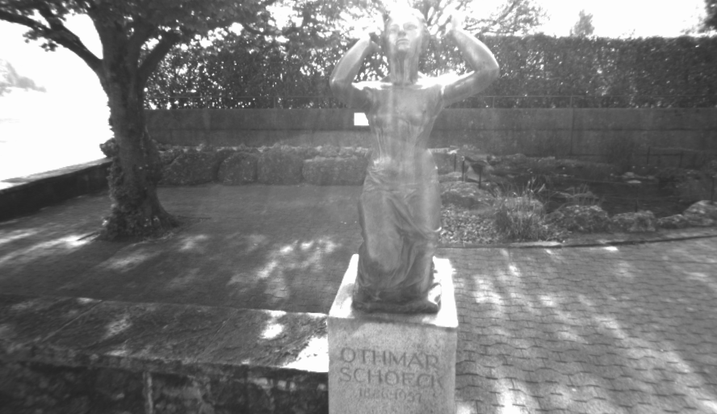
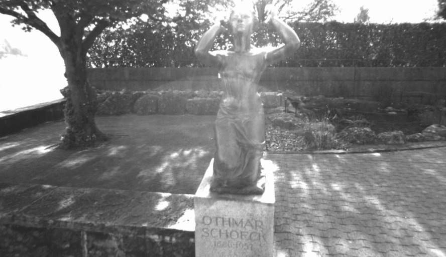
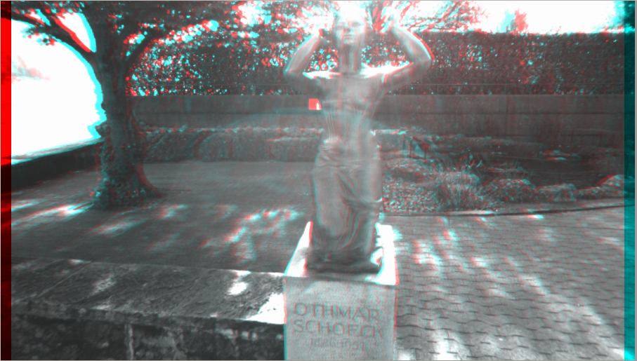
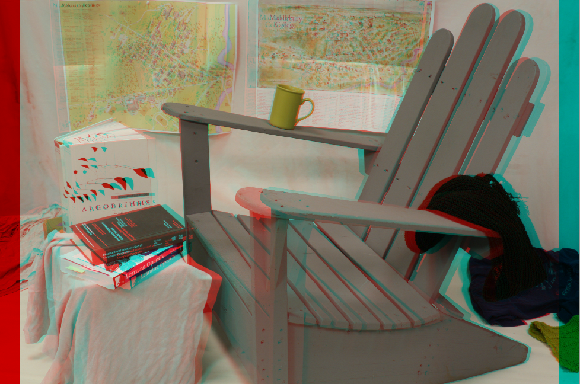

# A Qt based tool to show Epipolar stereo image

This is a Qt and CMake based project to show stereo image in one window in [Red/Cyan mode](https://en.wikipedia.org/wiki/Anaglyph_3D).
The Red/Cyan mode is also called stereo anaglyph, a [python based implement](https://github.com/miguelgrinberg/anaglyph.py) can be found, and the [algorithm](http://www.3dtv.at/knowhow/anaglyphcomparison_en.aspx) is not complicate, the optimized color is used.

## OVERVIEW
If you want to check parallax error in y(vertic), because this error is important for stereo Matching.

## USAGE
You can use QtCreate to import the porject, also you can use CMake, CMakeLists for **Ubuntu 16.04** :
```shell
mkdir build
cd build
cmake ..
make
```
### GUI
After you open the left and right image, the window only show the left image :
||
|     :---:      |
| *left image* |

Only after you click the **stereo**, then the main window shows the anaglyph image :

||
|     :---:      |
| *Red/Cyan mode* |

### Control bar and hot key
There are some other control bars for the software:
| Action | key | function |
| :---         |     :---:      |          :---: |
| Zoom in | -- | zoom in for the image | 
| Zoom out | -- | zoom out for the image | 
| Normal size | -- | normalize for the window to show the image | 
| Fit to window | -- | fit to window to show the image | 
| Left | -- | only show the left image | 
| Right | -- | only show the right image | 
| Red-Green | -- | shows the anaglyph image | 
| -- | Scroll | scroll the bar to show the image | 
| -- |ctrl + Scroll up | increase the disparity | 
| -- |ctrl + Scroll down | decrease the disparity | 
| -- |shit + ctrl + Scroll up | increase the disparity with 5x speed| 
| -- |shit + ctrl + Scroll down | decrease the disparity with 5x speed| 

### Setting
You can also set the intial disparity in the file **settings.ini**, for example, if you want the inital disparity is 100, you can write the value in the file:

```
disp=100
```

## FEATURE
Can hand both gray and color image.

### EXAMPLE
The gray image from [ETH3D](https://www.eth3d.net/datasets) dataset:
||||
| :---:         |     :---:      |          :---: |
| *left image* | *right image* | *Red/Cyan mode* | 

The gray image from [Middlebury stereo](https://vision.middlebury.edu/stereo/) dataset:
||||
| :---:         |     :---:      |          :---: |
| *left image* | *right image* | *Red/Cyan mode* | 

## MAINTENANCE
If you think you have any problem, contact Teng Wu <teng.wu@ign.fr>
